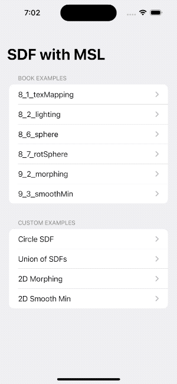
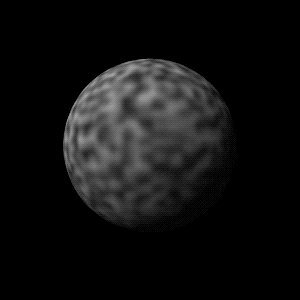
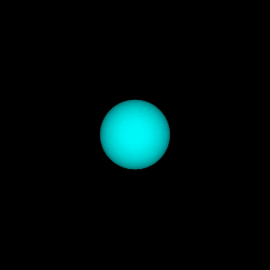

# Metal SDF Examples

Shape Animation Examples using SDF. Shaders are written in MSL (Metal Shader Language) with SwiftUI.

## What's this?

本リポジトリは、書籍「[リアルタイムグラフィックスの数学 - GLSLではじめるシェーダプログラミング | 巴山 竜来](https://amzn.to/43tnJy7)」の [GLSLサンプル](https://github.com/yutannihilation/math_of_realtime_graphics_wgsl_version) を MSL (Metal Shader Language) で写経したものです。

主に第II部「距離が作りし世界」のSDF関連のサンプルを扱っています。

学習のため、最小限の構成にしたサンプルや、3Dだったものを2Dにしたサンプルを追加したりもしています。

## Contents

### Book examples

- 8_1_texMapping
- 8_2_lighting
- 8_6_sphere
- 8_7_rotSphere
- 9_2_morphing
- 9_3_smoothMin
- 9_4_solidTexturing

- 9_5_displacement

- 9_10_norm

### Custom examples

- Circle SDF
- Union of SDFs
- 2D Morphing
- 2D Smooth Min
